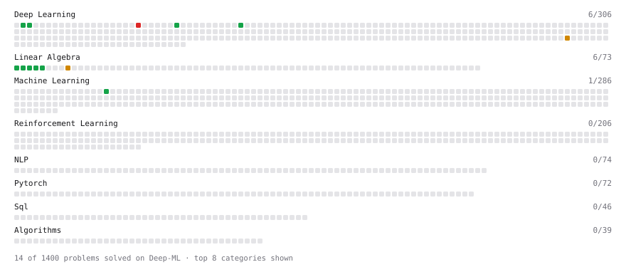

# Deep-ML

My machine learning practice from [Deep-ML](https://www.deep-ml.com). Every solution here was written by hand.

**11** solved · 11 problems · 0 labs · 0 math

[**Browse the interactive portfolio**](https://Kar-0-0.github.io/deep-ml/) to replay this filling in over time.

## Problems

| | Difficulty | Solved | |
| --- | --- | --- | --- |
| [Calculate Mean by Row or Column](https://www.deep-ml.com/problems/4) | easy | 2025-12-31 | [solution](problems/0004-calculate-mean-by-row-or-column) |
| [Dynamic Tanh: Normalization-Free Transformer Activation](https://www.deep-ml.com/problems/128) | easy | 2025-12-31 | [solution](problems/0128-dynamic-tanh-normalization-free-transformer-activation) |
| [Implement the Swish Activation Function](https://www.deep-ml.com/problems/102) | easy | 2025-12-31 | [solution](problems/0102-implement-the-swish-activation-function) |
| [Matrix-Vector Dot Product](https://www.deep-ml.com/problems/1) | easy | 2026-04-24 | [solution](problems/0001-matrix-vector-dot-product) |
| [Reshape Matrix](https://www.deep-ml.com/problems/3) | easy | 2026-04-24 | [solution](problems/0003-reshape-matrix) |
| [Scalar Multiplication of a Matrix](https://www.deep-ml.com/problems/5) | easy | 2026-04-24 | [solution](problems/0005-scalar-multiplication-of-a-matrix) |
| [Single Neuron](https://www.deep-ml.com/problems/24) | easy | 2026-04-24 | [solution](problems/0024-single-neuron) |
| [Softmax Activation Function Implementation ](https://www.deep-ml.com/problems/23) | easy | 2026-04-24 | [solution](problems/0023-softmax-activation-function-implementation) |
| [Transpose of a Matrix](https://www.deep-ml.com/problems/2) | easy | 2026-04-24 | [solution](problems/0002-transpose-of-a-matrix) |
| [Matrix times Matrix ](https://www.deep-ml.com/problems/9) | medium | 2026-04-25 | [solution](problems/0009-matrix-times-matrix) |
| [Implement Multi-Head Attention](https://www.deep-ml.com/problems/94) | hard | 2026-04-25 | [solution](problems/0094-implement-multi-head-attention) |

---

_This file is regenerated by Deep-ML on every push._
